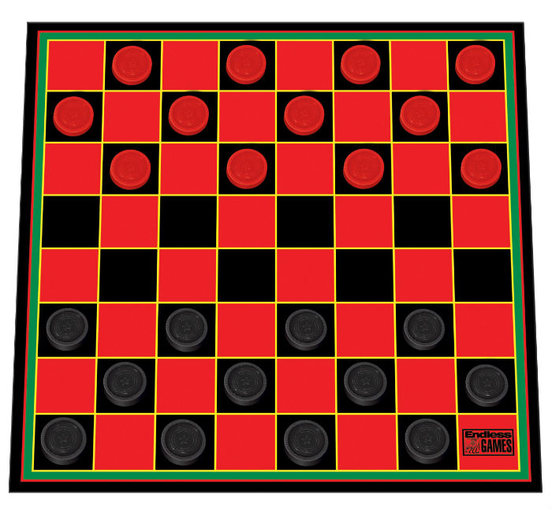

Web Online checkers (alpha)
===========================

Checkers is a two-player game, where one player is assigned white checkers and the other red.
The aim of the game is to capture the other player's checkers or make them impossible to move.

Introduction
------------

This project uses the Gradle build system. To build this project, use the
`gradlew build` command or use "Import Project" in Android Studio.

There are two Gradle tasks for testing the project:
* `connectedAndroidTest` - for running Espresso on a connected device
* `test` - for running unit tests

For more resources on learning Android development, visit the
[Developer Guides](https://developer.android.com/guide/) at
[developer.android.com](https://developer.android.com).

Screenshots
-----------

